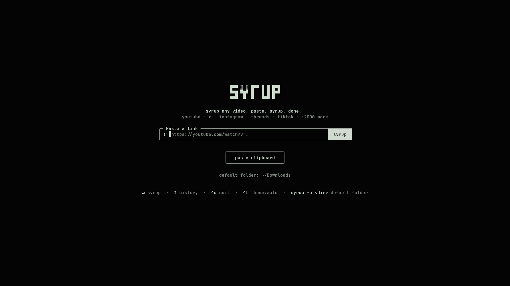
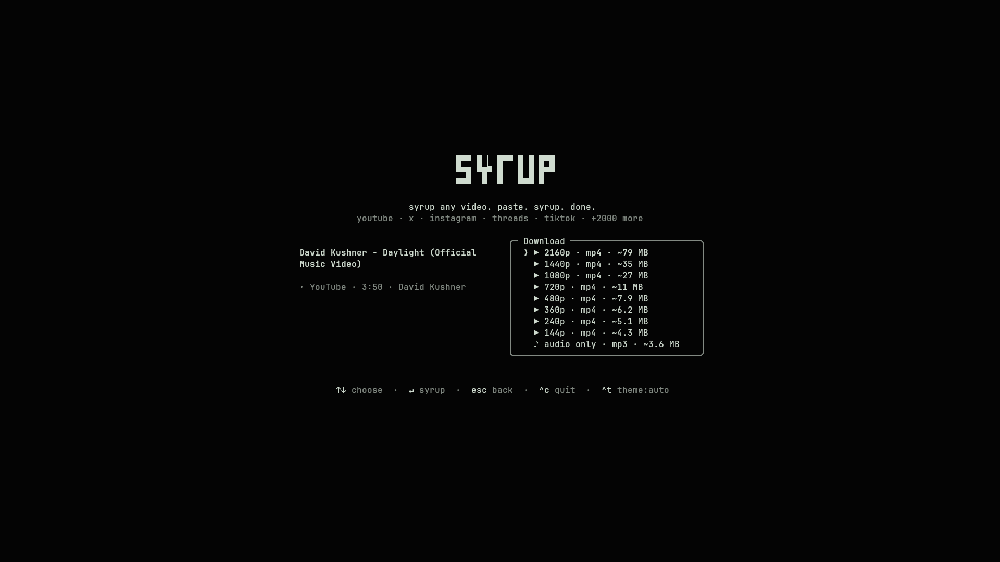

# Syrup

<picture>
  <source media="(prefers-color-scheme: dark)" srcset="assets/logo-dark.svg">
  
</picture>

syrup any video. paste. syrup. done.

Download videos from YouTube, X/Twitter, Instagram, Threads, TikTok and
2,000+ other sites — right from your terminal. Paste a url, pick a
resolution (or audio-only mp3), done. No popups, no fake download buttons,
no sketchy redirects.



## Install

One command — works on **Linux** and **macOS**. Installs everything you need automatically (including Node.js if you don't have it):

```sh
curl -fsSL https://raw.githubusercontent.com/arnavsharma66/syrup/main/install.sh | sh
```

Then open a new terminal and type `syrup`.

> **Already have Node.js 18+?** You can also run `npx syrup` to try it instantly without installing.

## Usage

```sh
syrup https://youtu.be/dQw4w9WgXcQ    # straight to the format picker
syrup                                  # paste a link interactively
syrup --best <url>                     # download best quality, no picker
syrup --mp3 <url>                      # download audio-only mp3
syrup -o ~/Videos                      # set default download folder
syrup --update                         # update the bundled yt-dlp
```

Syrup takes over the terminal (full-screen, centered — and restores your
scrollback on exit). Pick a format with ↑/↓ (or j/k, or number keys) and
hit enter. `esc` goes back, `^c` quits. Or just use the mouse — the syrup
button, the format list and the footer hints are all clickable, and
clicking the logo takes you back home. Files are saved to `~/Downloads`,
and the file path is printed to your terminal when you're done.

The default `auto` theme uses your terminal's own foreground and background,
so it follows light and dark terminal themes without guessing. Press `^t` or
click the theme control in the footer to cycle through `auto`, `light`, and
`dark` for the current session. Use `--theme auto`, `--theme light`, or
`--theme dark` to choose the starting theme for one launch.



## How it works

- Powered by [yt-dlp](https://github.com/yt-dlp/yt-dlp). On first run,
  Syrup downloads the standalone yt-dlp binary to `~/.syrup/bin` —
  no Python required. If you already have yt-dlp installed, it uses yours.
- ffmpeg (needed for merging high-res streams and mp3 extraction) is found
  on your PATH, with `ffmpeg-static` as a bundled fallback.
- The UI is [Ink](https://github.com/vadimdemedes/ink) — React for the
  terminal.

## Development

```sh
git clone https://github.com/arnavsharma66/syrup.git
cd syrup
npm install
npm run build        # bundle to dist/ with tsup
npm run dev          # rebuild on change
node dist/cli.js <url>
npm run typecheck
```

To try it as a global command without publishing: `npm link`, then run
`syrup` anywhere.

## Uninstall

```sh
npm uninstall -g syrup
rm -rf ~/.syrup ~/.config/syrup
```

## A note on fair use

Syrup is a personal-archiving tool. Downloading content may violate a
platform's terms of service — only download what you have the right to
keep, and be excellent to creators.

## License

[MIT](LICENSE)
